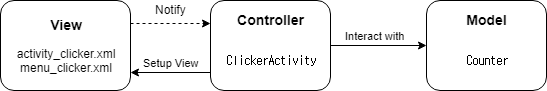

# Android MVC

**안드로이드 MVC 는 Activity/Fragment가 Controller 와 View 역할을 같이 가지고 있어 혼돈이 올 수 있다.**

### 모델 (Model)
> '모델' 은 데이터 + 상태 + 비즈니스 로직

### View
> '뷰'는 모델의 시각적 표현. 스크린과 위젯으로 구성.

### Controller
> '컨트롤러'는 사용자 입력에 반응하는 컴포넌트. 뷰와 모델 간 상호작용을 담당

##### 구조도

---

##### Source
[https://github.com/coolsoftwarelab/DesignPattern/tree/master/MVC](https://github.com/coolsoftwarelab/DesignPattern/tree/master/MVC)
