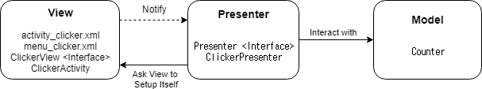

# Android MVP

### 모델 (Model)
> 데이터 + 상태 + 비즈니스 로직

### View
> UI. 뷰는 모델의 표현. 

### Controller
> 뷰와 모델 간 상호 작용을 담당.  뷰에 연결되는 것이 아니라 인터페이스로 연결

##### 구조도

---

##### Source
[https://github.com/coolsoftwarelab/DesignPattern/tree/master/MVP](https://github.com/coolsoftwarelab/DesignPattern/tree/master/MVP)
