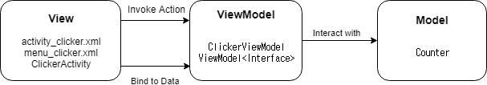

# Android MVVM

### 모델 (Model)
> 데이터 + 상태 + 비즈니스 로직

### View
> UI. 뷰는 뷰모델의 표현. 옵저버블 변수와 액션에 바인딩됨
ViewModel 을 옵저빙하고 있다가 상태 변화가 전달되면 화면 갱신

### ViewModel
> View를 표현하기 위해 만들어진 View를 위한 Model

##### 구조도

---

##### Source
[https://github.com/coolsoftwarelab/DesignPattern/tree/master/MVVM](https://github.com/coolsoftwarelab/DesignPattern/tree/master/MVVM)
