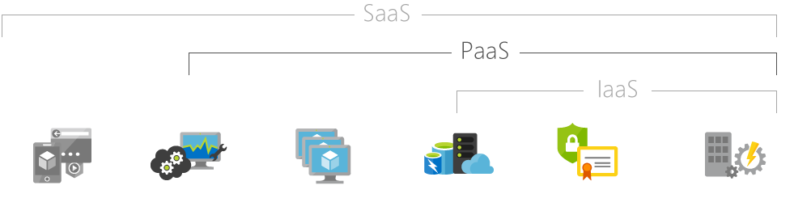

### IaaS (Infrastructure as a Service)

>물리적 자원 제공.  
서비스로서의 인프라스트럭처는 서버, 스토리지, 네트워크를 필요에 따라 인프라 자원을 사용할 수 있게 클라우드 서비스를 제공하는 형태이다. 대표적인 기술로는 서버 가상화, 데스크톱 가상화 등이 있다.  

Ex) 마이크로소프트 애저, 아마존 CloudFormation (와 같은 기본 서비스를 아마존의 EC2 )

### PaaS (Platform as a Service)

>소프트웨어 개발을 돕는 플랫폼 제공  
서비스로서의 플랫폼은 클라우드 컴퓨팅 서비스 분류 중 하나다. 일반적으로 앱을 개발하거나 구현할 때, 관련 인프라를 만들고 유지보수하는 복잡함 없이 애플리케이션을 개발, 실행, 관리할 수 있게 하는 플랫폼을 제공한다.

Ex) 구글이나 네이버, 다음 등에서 제공하는 공개 API ...

### SaaS (Software as a Service)

>고객이 사용하는 소프트웨어 제공  
서비스로서의 소프트웨어(Software as a Service, SaaS)는 소프트웨어 및 관련 데이터는 중앙에 호스팅되고 사용자는 웹 브라우저 등의 클라이언트를 통해 접속하는 형태의 소프트웨어 전달 모델이다.  
주문형 소프트웨어(on-demand software, 온디맨드 소프트웨어)라고도 한다.

Ex) 구글의 Gmail, 네이버의 N클라우드, 구글의 Google Drive, Dropbox ...

