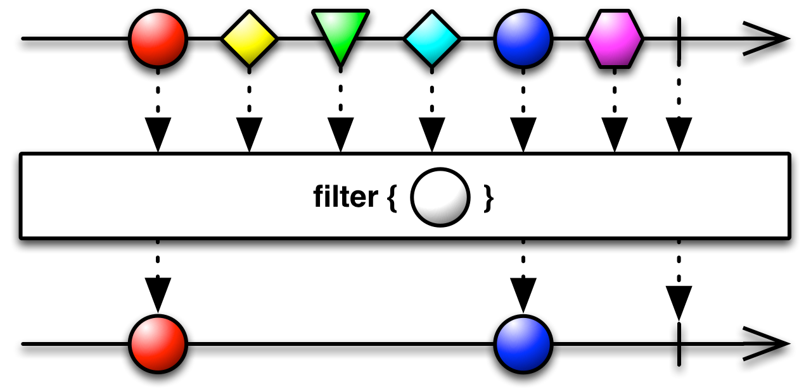

# RxJava
> Java 로 Reactive Programming 을 구현하기 위한 라이브러리

#### 구성요소
- Observable
- Observer
- Operator

### Observable

> 데이터 제공자.<br>
지속적으로 흐름을 파악할 수 있는 데이터.<br>
Ex) 현실에서 유튜버를 **Observable** 하다 라고 할 수 있고, 유튜버를 구독하는 사람들을 **구독자(Subscriber)** 라고 할 수 있다.

Observable 의 두 가지 종류

- Hot Observable
구독자(Subscriber) 가 없어도 동작 (클릭 이벤트, 센서 이벤트 등)

- Cold Observable
구독자(Subscriber) 가 있을 때만 동작 (웹 요청, DB쿼리 등)

Observable 예시

- just 를 통해 1, 2, 3, 4 를 Emit(방출) 하는 Observable :

```
Observable observable = Observable.just(1, 2, 3, 4);
observable.subscribe(t -> System.out.println("t : " + t));      // 1 2 3 4
```

- create 를 통해 1, 2, 3, 4 를 방출하는 Observable :
```
Observable observable = Observable.create((ObservableOnSubscribe<String>) emitter -> {
    try {
//                (ObservableOnSubscribe) emitter
//                emitter.onNext(1);
//                emitter.onNext(2);
//                emitter.onNext(3);
//                emitter.onNext(4);

	List<String> strList = new ArrayList<>();
	strList.add("1");
	strList.add("2");
	strList.add("3");
	strList.add("4");
	for (String str : strList) {
	    emitter.onNext(str);
	}
	emitter.onComplete();
    } catch (Exception e) {
	emitter.onError(e);
    }
});

observable.subscribe(t -> Log.d(TAG, "t : " + t));	// 1 2 3 4
```

Observable과 Observable의 전환을 표현하는 마블 다이어그램


### Observer
>데이터 수신자.<br>
Observer는 Observable을 구독한다.<br>
Ex) 유튜브 시청자

#### 메소드

`onNext(T)`

Observable 이 하나의 T 객체를 내보낼 때 호출된다.
여러 개의 객체인 경우 각 객체가 처리될 때 마다 호출된다.

`onCompleted()`

Observable 이 객체를 다 내보내면 호출. 동작 완료의 의미이다.

`onError(Throwable)`

Observable 은 기대하는 데이터가 생성되지 않았거나 다른 이유로 오류가 발생할 경우 오류를 알리기 위해 이 메서드를 호출한다. 이 메서드가 호출되면 onNext나 onCompleted는 더 이상 호출되지 않는다.

#### DisposableObserver
>메모리 누수를 방지하기 위한 Observer 이며, Thread-Safe 하다.

```
Observable<Integer> observable = Observable.just(1, 2, 3, 4);

DisposableObserver<Integer> disposableObserver = new DisposableObserver<Integer>() {
    @Override
    protected void onStart() {
	System.out.println("Start!");
    }

    @Override
    public void onNext(Integer t) {
	if (t == 3) {
	    dispose();
	}
	System.out.println("t : " + t); // 3 times call (1 2 3)
    }

    @Override
    public void onError(Throwable e) {
	// error occured
    }

    @Override
    public void onComplete() {
	// It is called after onNext() completes.
    }
};

Disposable d = observable.subscribeWith(disposableObserver);
d.dispose();
```

### Operator
> 연산자<br>
Rx 를 지원하는 언어 별 구현체들은 다양한 연산자들을 제공하는데, 이 중에는 공통적으로 제공되는 연산자도 있지만 반대로 특정 구현체에서만 제공하는 연산자들도 존재한다.

**`Just`** : 객체 하나 또는 객채집합을 Observable로 변환한다. 변환된 Observable은 원본 객체들을 발행한다

**just 마블다이어그램 (marble diagram)**


**just 예제**
<pre><code>Observable<String> observable = Observable.just("1", "2", "3", "4");
        DisposableObserver<String> disposableObserver = observable.subscribeWith(new DisposableObserver<String>() {
            @Override
            public void onNext(String s) {
                // s is "1", "2", "3", "4" (4 times called)
            }

            @Override
            public void onError(Throwable e) {
		// error occured
            }

            @Override
            public void onComplete() {
		// It is called after onNext() completes.
            }
        });
</code></pre>

**`filter`** : 테스트 조건을 만족하는 항목들만 배출한다.

아래 예제 코드에서는 `onNext()` 에서 정수 '3' 이 전달되고 이후 `onComplete()` 가 호출된다.

**filter 예제**
```
Observable<Integer> observable2 = Observable.just(1, 2, 3, 4, 5)
                .filter(new AppendOnlyLinkedArrayList.NonThrowingPredicate<Integer>() {
                    @Override
                    public boolean test(Integer value) {
                        if(value == 3) {
                            return true;
                        }
                        return false;
                    }
                });

        DisposableObserver<Integer> disposableObserver2 =
                observable2.subscribeWith(new DisposableObserver<Integer>() {
            @Override
            public void onNext(Integer value) {
		System.out.println("value : " + value	// 3
            }

            @Override
            public void onError(Throwable e) {

            }

            @Override
            public void onComplete() {
		// It is called after onNext() completes. 
            }
        });
```

**filter 마블다이어그램 (marble diagram)**<br>


### 구성 요소 외 Thread 관리 기능

#### Scheduler
>데이터를 처리하고자 하는 특정한 스레드

Scheduler | 용도
----------|-----------
Schedulers.computation( ) | 이벤트-루프와 콜백 처리 같은 연산 중심적인 작업을 위해 사용된다. 그렇기 때문에 I/O를 위한 용도로는 사용하지 말아야 한다(대신 Schedulers.io( )를 사용) 기본적으로 스레드의 수는 프로세서의 수와 같다
Schedulers.io( ) | 블러킹 I/O의 비동기 연산 같은 I/O 바운드 작업을 처리한다. 이 스케줄러는 필요한 만큼 증가하는 스레드-풀을 통해 실행된다; 일반적인 연산이 필요한 작업은 Schedulers.computation( )를 사용하면 된다
Schedulers.newThread( )	 | 각각의 단위 작업을 위한 새로운 스레드를 생성한다
AndroidScheduler.mainThread() | RxAndroid 라이브러리에서 사용하는 방식으로 메인 스레드에서 동작해야하는 (UI 처리) 작업을 위해 사용

#### Observable 의 연산자를 활용한 Scheduler 사용

1. subscribeOn()<br>
Observable을 구독할 때 사용할 스케줄러를 명시한다 (특정한 스레드를 지정해서 데이터 처리)
한번만 사용하능하며, 여러 번 중첩해서 선언하는 경우 처음 지정한 스레드로 동작한다<br>
데이터 전달자가 사용하는 스레드를 지정한다.

2. observeOn()<br>
옵저버가 어느 스케줄러 상에서 Observable을 관찰할지 명시한다 (결과를 받는 스레드)
따로 지정하지 않으면 subscribeOn() 에서 지정한 스레드로 동작한다.
subscribeOn() 과 달리 observeOn() 은 여러번 호출하여 각각 연산에 대한 스레드를 달리 할 수 있다.

**observeOn()이 우선된다.**

- subscribeOn() 선언 후 observeOn() 이 선언되면 subscribeOn()은 무시되고,
observeOn() 이 먼저 선언되고 subscribeOn()이 선언되어도 observeOn() 으로 동작한다.

<br>

#### Scheduler를 지정하지 않았을 때
```
Observable<Integer> observable = Observable.just(1, 2, 3, 4, 5)
	.map(t -> {
	    System.out.println("Thread in map : " 
	    	+ Thread.currentThread().getName());  // main
	    return t + 1;
	});

observable.subscribe(t -> {
    System.out.println("Thread in map : " 
    	+ Thread.currentThread().getName()); // main
});
```

#### subscribeOn(Schedulers.io())
```
Observable<Integer> observable = Observable.just(1, 2, 3, 4, 5)
	.map(t -> {
	    System.out.println("Thread in map : " 
	    	+ Thread.currentThread().getName());  // RxCachedThreadScheduler-1
	    return t + 1;
	});

observable.subscribeOn(Schedulers.io())
	.subscribe(t -> {
    System.out.println("Thread in subscribe : " 
    	+ Thread.currentThread().getName()); // RxCachedThreadScheduler-1
});
```

#### subscribeOn(Schedulers.computation())
```
Observable<Integer> observable = Observable.just(1, 2, 3, 4, 5)
	.map(t -> {
	    System.out.println("Thread in map : " 
	    	+ Thread.currentThread().getName());  // RxComputationThreadPool-1
	    return t + 1;
	});

observable.subscribeOn(Schedulers.computation())
	.subscribe(t -> {
	    System.out.println("Thread in subscribe : " 
	    	+ Thread.currentThread().getName()); // RxComputationThreadPool-1
	});
});
```

<br>
<br>

#### subscribeOn(Schedulers.computation()), observeOn(AndroidSchedulers.io())
```
Observable<Integer> observable = Observable.just(1, 2, 3, 4, 5)
	.map(t -> {
	    System.out.println("Thread in map : " + Thread.currentThread().getName());  // RxComputationThreadPool-1
	    return t + 1;
	});

observable.subscribeOn(Schedulers.computation())
	.observeOn(Schedulers.io())
	.subscribe(t -> {
	    System.out.println("Thread in subscribe : " + Thread.currentThread().getName()); // RxCachedThreadScheduler-1
	});
```

<br>

### Multiple scheduler test
```
Observable<Integer> observable = Observable.just(0, 1, 2, 3, 4)
	.map(t -> {
	    System.out.println("Thread in map : " + Thread.currentThread().getName());  // RxCachedThreadScheduler-1
	    return t + 1;
	});

observable.subscribeOn(Schedulers.io())
	.observeOn(Schedulers.computation())
	.reduce((a, b) -> {
	    System.out.println("Thread in reduce : " + Thread.currentThread().getName());  // RxComputationThreadPool-1
	    return a + b;
	})
	.observeOn(Schedulers.computation())
	.filter(t -> {
	    System.out.println("Thread in filter : " + Thread.currentThread().getName());  // RxCachedThreadScheduler-2
	    if (t == 15) {
		return true;
	    }
	    return false;
	})
	.observeOn(AndroidSchedulers.mainThread())
	.subscribe(t -> {
	    System.out.println("Thread in subscribe : " + Thread.currentThread().getName()); // main
	    System.out.println("Thread in subscribe t : " + t); // 15
	});
```

